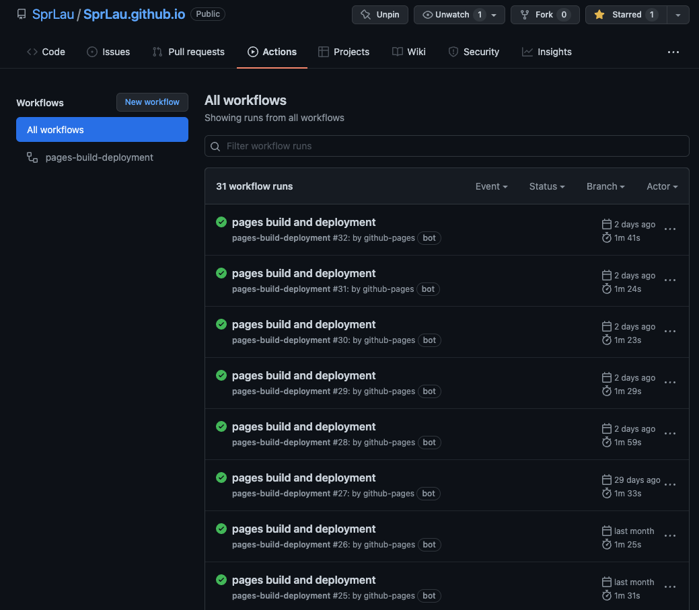
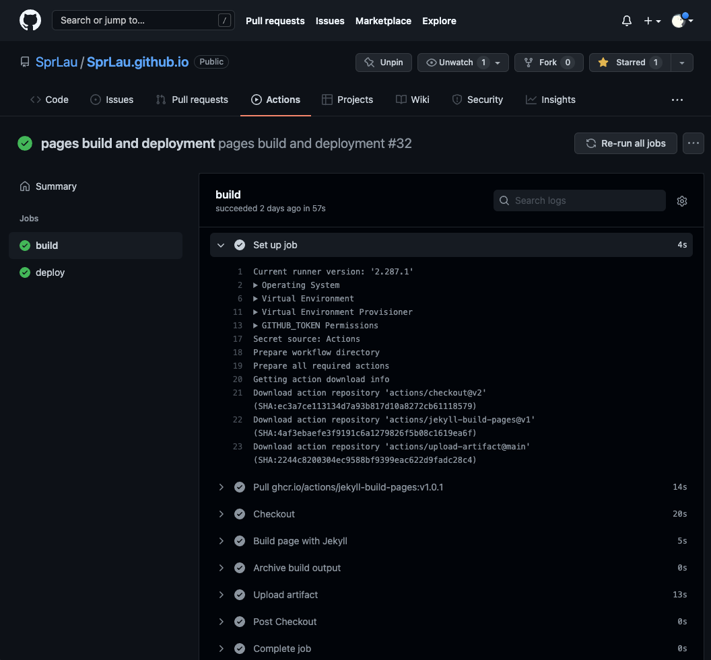
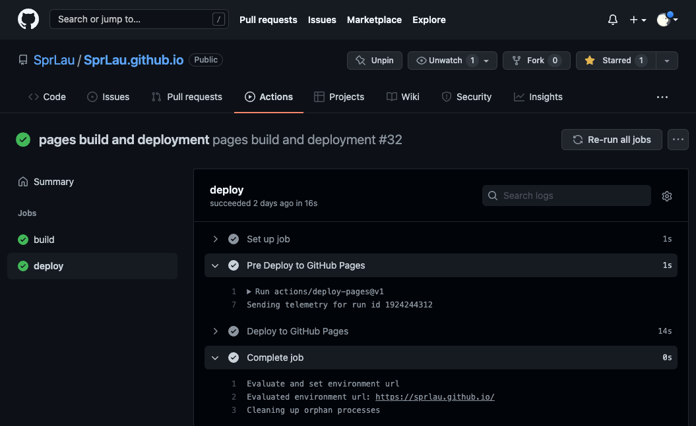
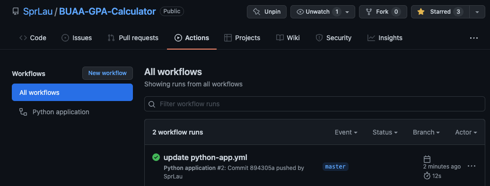
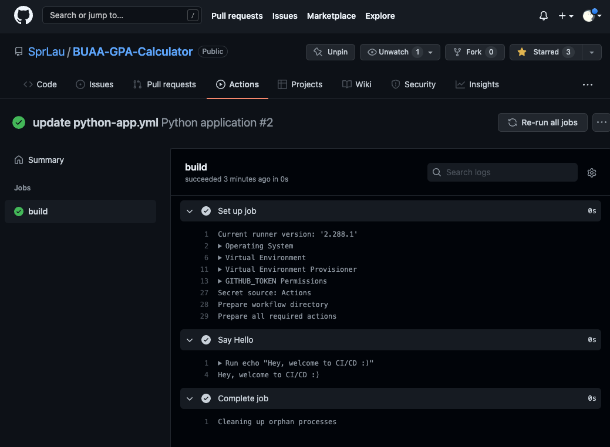

# 个人阅读作业-阅读和调研

***刘兆薰 19373345***

## 阅读提问

1. 在“软件工程概论”章节中有一句话：

   >  一个好的软件，即使功能和同类软件区别不大，但是会让人感觉到非常好用。这就是软件的“**用户体验**” (**User Experience**) 特别好。用户体验和数据结构，算法没什么关系，但是很多非常成功的软件就赢在这个方面。

   我的问题是，是否程序员也需要掌握用户体验设计的几大设计原理？我看许多互联网巨头公司都会有专门的用户体验设计师岗位，而且国外的很多名牌大学也在认知科学或者信息学系专门设置了这个专业方向。但是既然成功软件的很大一部分仰仗于其良好的用户体验，这也在无形中要求软件工程师需要掌握用户体验的设计原则。所以，为何长久以来用户体验设计师或者用户体验专业没有被软件工程师或者计算机系所代替？或者说程序员在哪些地方是必须依赖一个额外的用户体验设计师的？

2. 在“工程师的能力评估和发展”章节中有一句话：

   > 另外, 优秀的作品往往并不符合所有“好”的标准。 例如，找出下面这首词中重复的字：
   >
   > 念奴娇 · 赤壁怀古 - 苏轼 ……

   我认为作者在此处将软件工程和苏轼的词作比较来说明软件的整体艺术性重要于细节实现是不恰当的。首先，苏轼的词是豪放旷达的，浪漫主义充盈着苏轼的这首念奴娇。这也是艺术和技术最不融合的地方，因为浪漫可以让艺术名垂青史，但是往往会让技术遗臭万年。技术是一丝不苟的，是严格的。虽然技术和艺术可以擦出令人惊奇的火花，但是技术本身是理性的。所以我认为作者如果一定要联系到艺术的话，也应该将软件工程同巴赫的音乐相比。巴赫的平均律是严密的数学和精确的计算，每一个音符都出现在最完美的位置。这和我心目中完美的软件工程是一致的，即每一行代码、每一处代码风格都是符合标准和细节的。如果一名软件工程师连最基本的细节都做不到的话，很难指望这名软件工程师会持续性地开发出令人满意的项目；就算有个人项目出类拔萃，一个严谨的总监也很难接纳这个应聘者的，因为一个员工不太可能自己完全承担一个商业项目，但有很大可能在团队中无法很好融入公司的各项代码标准，导致整体团队的开发效率变低。

3. 在“技能的反面——魔方与模仿”章节中，作者以这样的话做结语：

   > 那怎么才能考察出一个人“精通”魔方呢? 我想了这样一个办法:
   >
   > a)   给面试者一个各面打乱颜色的魔方
   >
   > b)   要求他把六面还原
   >
   > c)   如果还原了, 要求他把魔方恢复成我最初给他那个混乱的局面, 必须一模一样。 

   我没有完全理解作者以这段话做结的意图。作者是想告诉我们必须有逆向思维吗？但是程序的逆向思维是什么呢？是编写完一个项目之后可以给别人讲出从最后一句到第一句是什么意思吗？但是这样做的意义似乎是不明确的。我不了解魔方，我认为将还原的魔方返回到最初的混乱状态是一个比较不可回溯的过程，然而程序的每一行都是清晰且可以回看的。这样的结语似乎第一无法说明任何问题，第二和前文重笔墨探讨的项目抄袭几乎没有关系，在我看来比较莫名其妙。不知道作者的真正意图是？

4. 在“两人合作要会做汉堡包”章节中有一句话：

   > 有一个说法, 创业家在创业初期必须要说服三个F: Family, Friend, and a Fool. 如果Family 和 Friend 都没人支持你的想法, 第三个F 估计也帮不了带大的忙。

   前两个F好理解，但是我们为什么要给一个Fool解释我们的计划并且要期待来自Fool的任何评论呢？既然我们已经知道对方是Fool，那么他的意见的建设性是不大的。我认为第三个F应该是Folks。Folks可以指普通人，即软件的普通用户。这部分人往往占据了一个软件大部分的适用群体，所以他们对于一款未发布产品期待与否才应该是软件团队关心的重点，因为这直接影响销量。

5. 在“用户调研”章节中提到了两个方法：

   > **深入面谈** 和 **用户调查问卷**

   史蒂夫·乔布斯曾在苹果公司开发的iTunes饱受诟病时公开表示苹果公司永远不做市场调研，因为用户不知道自己想要什么。他们只会在你把新东西放在他们面前的时候他们才会说，哇，这才是我想要的！(“People don't know what they want until you show it to them. That's why I never rely on market research.”)

   我认为乔布斯的观点是正确的。用户除了一些基本需求（比如微信的云同步消息记录）希望软件公司做出改进，其实是根本无法作出太具有建设性和突破性的意见的。然后，软件的开发者也一定是使用者，我们知道一个好的软件需要做到什么，甚至比用户更加清楚和专业。我不否认需要在产品开发前细致入微地设计项目，但是我认为和用户深入面谈或者回收其调查问卷是几乎无意义的。

6. 在“开发阶段的日常管理”章节中有这样一段话：

   > 如果你是写一个商业项目，请不要让连开发语言都没有接触过的队员进行开发工作。并不是非得 “写” 程序才是对项目有贡献，有时不写也有很好的贡献。如果他们有热情，就从测试开始学习吧。

   作者说一个从来没有接触过某们编程语言的人在项目组中从测试人员开始做起，但是我认为测试人员反而更加需要专业的语言能力。因为测试在我的心目中是稳定软件市场口碑的镇山石，如果测试人员对开发人员所用的语言完全不懂的话，我认为测试人员是无法对开发人员提出高效修改意见的。学习一门新语言很容易，但是能够一眼看出新语言的bug是会难很多的。所以在我的心目中，测试人员，至少在语言理解度上，需要比开发人员更强悍。

7. 在“源代码管理”章节中作者提到利用好诸如GitHub这样的管理平台来检查提交代码的规范性，但是我不知道能否通过GitHub来检查提交的代码是否符合团队代码风格规范？我试图在StackOverflow上寻找答案，但是似乎没有人能够真正通过这种方法来检验比对代码风格。如果像GitHub这样的平台无法做到的话，是否只能先手动添加到自己的IDE中逐文件查看才能检查代码规范？

## 调研源代码版本管理软件

目前工业界和学术界用的最多的两个版本管理平台就是GitHub和GitLab了。Bitbucket没有听说哪家公司在用，在此就不讨论了；如果Bitbucket日后崛起赶Hub超Lab，那我为我的莽撞自罚三杯。

首先，GitHub和GitLab两者最大的相同点就是都是基于Git的。Git 是一个版本控制系统；版本控制是一种用于记录一个或多个文件内容变化，方便我们查阅特定版本修订情况的系统。

然而，其两者之间最大的不同点在于私有性的友好程度。如果个人写的代码是不重要的，可以让所有人看看，选择开源，选哪一个都没差别，甚至得益于GitHub得天独厚的开源环境，GitHub会是更好的选择。但是如果个人写的代码比较有竞争力和商业价值，不想让别人看到，就使用GitLab，因为GitLab免费支持私人仓库，而GitHub需收费。如果是公司团队开发的代码，务必只能选择GitHub，搭建公司个人的GitLab服务，才能确保数据安全。

综上，GitHub和GitLab就像淘宝和京东，按照每一次的需求选择管理平台才是最明智的，也没必要踩一捧一。

## 调研持续集成/部署工具

个人GitHub主页：https://github.com/SprLau/

### 解决方案 I —— 基于React的个人GitHub Pages网站部署

项目库链接：https://github.com/SprLau/SprLau.github.io/

个人主页（成品）：https://sprlau.github.io/

#### CI/CD Action, Workflows



#### CI/CD Jobs, Steps





### 解决方案 II —— GitHub Repo在Push时执行简单Action

代码库链接：https://github.com/SprLau/BUAA-GPA-Calculator/

#### .github/workflows/python-app.yml

```yml
name: Python application

on:
  push:
    branches: [ master ]
  pull_request:
    branches: [ master ]

jobs:
  build:
    runs-on: ubuntu-latest

    steps:
    - name: Say Hello
      run: |
        echo "Hey, welcome to CI/CD :)"
```

#### CI/CD Action, Workflows



#### CI/CD Jobs, Steps



### CI/CD工具的特点和特性

CI/CD是实现敏捷和Devops理念的一种方法。具体而言，CI/CD 可让持续自动化和持续监控贯穿于应用的整个生命周期（从集成和测试阶段，到交付和部署）。这些关联的事务通常被统称为“CI/CD 管道”，由开发和运维团队以敏捷方式协同支持。

CI特点：让产品可以快速迭代，频繁地将代码集成到主干，同时还能保持高质量。

CD特点：保证团队开发人员提交代码的质量，减轻了软件发布时的压力。持续集成中的任何一个环节都是自动完成的，无需太多的人工干预，有利于减少重复过程以节省时间、费用和工作量。

### CI/CD进一步分析

一旦部署了现代化的 CI/CD 流水线，软件工程师可能会意识到开发人员工作流程中的一些工具和流程也需要进行现代化改造。测试是一个需要着重关注的领域。如果部署频率是每天或者一天多次，那么每次测试可能需要数小时甚至一晚上才能完成。为提高效率，已经有机构在使用机器学习解决这个问题，比如mabl。

### GitLab vs GitHub CI/CD比较

GitLab主要优势在于非第三方对CD- Build和CI的控制，这对保护项目私密性有很好的支持。并且GitLab可以搭建属于自己的CI/CD Pipeline Config，这对商业或者私密项目的保护是很好的。

而GitHub的Actions功能十分简便，也有很多已有的开源`.yml`可供使用。如果自己要开发兴趣项目或者个人展示项目，用GitHub是不错的选择。